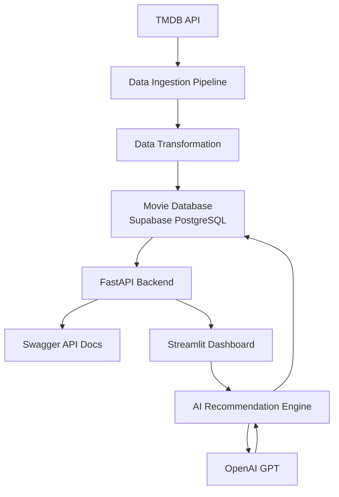
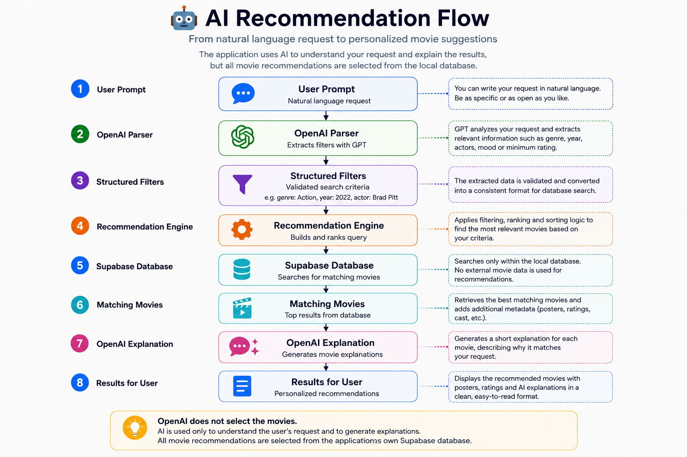
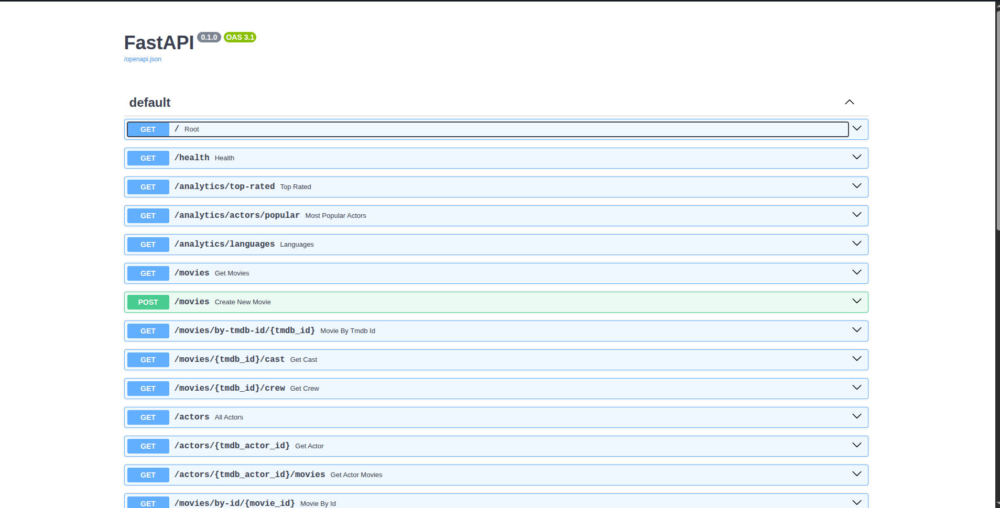

<div align="center">

# 🎬 Movie Analytics Dashboard

### End-to-end movie analytics and AI recommendation platform

Built with **FastAPI**, **Supabase**, **Streamlit**, **TMDB API** and **OpenAI**

<br>


<br>

🚀 **Live API:** https://movie-project-fast-api.onrender.com/docs

📂 **GitHub Repository:** https://github.com/ErikBobko/movie_project_fast_api

🖥️ **Live Dashboard:** https://movie-analytics-valasek.streamlit.app/
</div>

---

## Overview

Movie Analytics Dashboard is an end-to-end data application that downloads movie data from the TMDB API, transforms it, stores it in a PostgreSQL database hosted on Supabase, exposes it through a FastAPI backend and presents the results in an interactive Streamlit dashboard.

The application also includes AI-powered movie recommendations. A natural-language request is converted into structured filters, the application searches its own Supabase database, and AI generates a short explanation for each recommendation.

<p align="center">
  
</p>

## ✨ Features

<table>
<tr>

<td width="50%">

### 📊 Analytics Dashboard

- Interactive KPIs
- Movie statistics
- Genre distribution
- Rating analysis
- Popularity metrics

</td>

<td width="50%">

### 🔍 Movie Search

- Search by title
- Pagination support
- Movie details
- Similar movie recommendations
- Optimized database queries

</td>

</tr>

<tr>

<td width="50%">

### 🎭 Actor Analytics

- Top actors by movie count
- Highest-rated actors
- Most popular actors
- Interactive charts
- Actor profiles & filmography

</td>

<td width="50%">

### 🤖 AI Recommendations

- Natural language movie search
- GPT-powered filter extraction
- Database-driven recommendations
- AI-generated explanations
- Personalized movie suggestions

</td>

</tr>

<tr>

<td width="50%">

### ⚡ FastAPI Backend

- REST API
- Interactive Swagger documentation
- Pagination
- Filtering
- Production deployment

</td>

<td width="50%">

### 🗄️ Database

- Supabase PostgreSQL
- Normalized relational schema
- Many-to-many relationships
- TMDB ETL pipeline
- Automatic data synchronization

</td>

</tr>

</table></table>

## 🏗️ Architecture


## 📁 Project Structure

```text
movie_project_fast_api/
│
├── clients/
│   └── TMDB API communication
│
├── pipelines/
│   └── Data ingestion and synchronization
│
├── services/
│   └── Business logic and database operations
│
├── models/
│   └── Pydantic data models
│
├── streamlit_app/
│   └── Interactive analytics dashboard
│
├── docs/
│   └── README screenshots
│
├── db.py
│   └── Supabase connection
│
├── config.py
│   └── Environment configuration
│
├── main.py
│   └── FastAPI application
│
└── requirements.txt
    └── Project dependencies
```
## 🤖 AI Recommendation Flow

The AI recommendation system combines natural language understanding with deterministic database queries.

Instead of allowing AI to generate random movie suggestions, every recommendation comes exclusively from the application's own movie database.

<p align="center">
  
</p>

### Example

**User request**

```text
Find me the best action movies after 2020 with Brad Pitt.
```

↓

**Extracted filters**

```json
{
  "genre": "Action",
  "year_from": 2020,
  "actor": "Brad Pitt",
  "sort_by": "rating"
}
```

↓

**Recommendation process**

1. OpenAI extracts structured filters from the prompt.
2. The recommendation engine searches the local Supabase database.
3. Matching movies are ranked according to the selected criteria.
4. OpenAI generates a short explanation for each recommendation.

> **Note**
>
> OpenAI is used only to understand the user's request and generate explanations.
> Movie recommendations are always selected from the application's own database.
> 
> ## 🚀 API Endpoints

The FastAPI backend exposes REST endpoints for movie analytics, actor information, synchronization and AI recommendations.

| Method | Endpoint | Description |
|---------|----------|-------------|
| GET | `/movies` | Retrieve movies with pagination |
| GET | `/movies/{tmdb_id}` | Movie details |
| GET | `/movies/{tmdb_id}/cast` | Movie cast |
| GET | `/movies/{tmdb_id}/crew` | Movie crew |
| GET | `/actors` | Search actors |
| GET | `/actors/{tmdb_actor_id}` | Actor profile |
| GET | `/analytics/top-rated` | Highest-rated movies |
| GET | `/analytics/actors/top` | Top actors by movie count |
| POST | `/sync/full` | Synchronize the local database |
| POST | `/ai/recommendations` | AI-powered recommendations |


<p align="center">
  
</p>

## 🌐 Live Demo

| Service | Link |
|---------|------|
| 🎬 Streamlit Dashboard | https://movie-analytics-valasek.streamlit.app/ |
| 🚀 FastAPI Swagger | https://movie-project-fast-api.onrender.com/docs |

## 🛠 Tech Stack

| Category | Technologies |
|----------|--------------|
| Language | Python |
| Backend | FastAPI |
| Database | Supabase PostgreSQL |
| Frontend | Streamlit |
| AI | OpenAI GPT |
| Data Source | TMDB API |
| Deployment | Render, Streamlit Community Cloud |
| Version Control | Git & GitHub |

## ⚙️ Installation

```bash
git clone https://github.com/ErikBobko/movie_project_fast_api.git

cd movie_project_fast_api

pip install -r requirements.txt

uvicorn main:app --reload

streamlit run streamlit_app/app.py
```
## 🔮 Future Improvements

- User authentication
- Personal watchlists
- Advanced recommendation algorithms
- Docker deployment
- Unit and integration testing
- CI/CD pipeline
## 📄 License

This project was created for educational purposes and as part of my backend Python portfolio.