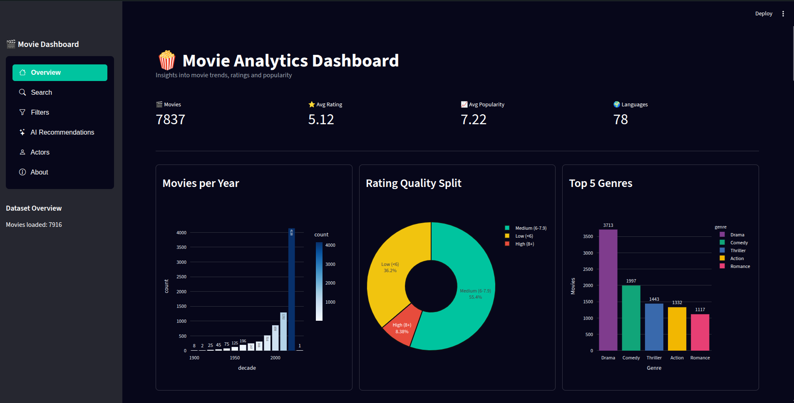
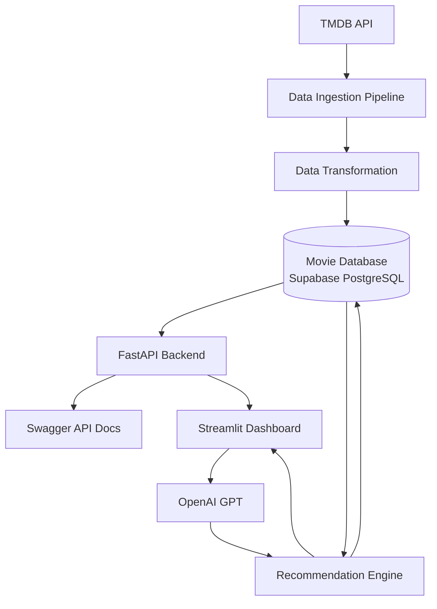

# 🎬 Movie Analytics Dashboard

### End-to-end movie analytics and AI recommendation platform

Built with **FastAPI**, **Supabase**, **Streamlit**, **TMDB API** and **OpenAI**

 

 

🚀 **Live API:** https://movie-project-fast-api.onrender.com/docs

📂 **GitHub Repository:** https://github.com/ErikBobko/movie_project_fast_api

🖥️ **Live Dashboard:** Coming soon

---

## Overview

Movie Analytics Dashboard is an end-to-end data application that downloads movie data from the TMDB API, transforms it, stores it in a PostgreSQL database hosted on Supabase, exposes it through a FastAPI backend and presents the results in an interactive Streamlit dashboard.

The application also includes AI-powered movie recommendations. A natural-language request is converted into structured filters, the application searches its own Supabase database, and AI generates a short explanation for each recommendation.

  

## ✨ Features

<table>
<tr>

<td width="50%">

### 📊 Analytics Dashboard

- Interactive KPIs
- Movie statistics
- Genre distribution
- Rating analysis
- Popularity metrics

</td>

<td width="50%">

### 🔍 Movie Search

- Search by title
- Pagination support
- Movie details
- Similar movie recommendations
- Optimized database queries

</td>

</tr>

<tr>

<td width="50%">

### 🎭 Actor Analytics

- Top actors by movie count
- Highest-rated actors
- Most popular actors
- Interactive charts
- Actor profiles & filmography

</td>

<td width="50%">

### 🤖 AI Recommendations

- Natural language movie search
- GPT-powered filter extraction
- Database-driven recommendations
- AI-generated explanations
- Personalized movie suggestions

</td>

</tr>

<tr>

<td width="50%">

### ⚡ FastAPI Backend

- REST API
- Interactive Swagger documentation
- Pagination
- Filtering
- Production deployment

</td>

<td width="50%">

### 🗄️ Database

- Supabase PostgreSQL
- Normalized relational schema
- Many-to-many relationships
- TMDB ETL pipeline
- Automatic data synchronization

</td>

</tr>

</table></table>

## 🏗️ Architecture

